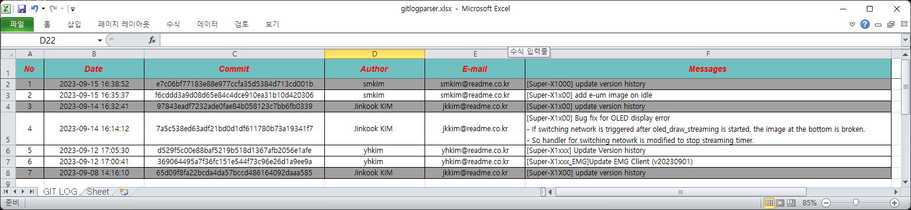

# gitlog2xls
Extract log from git repository and Save with xls format

## Pre-work
- Extract git log from repository and redirect to text file
   ```
   git log > git_commit.log
   ```

## File Format
<details>
<summary>git_commit.log</summary>
- Parsing file included git log is like below.
  
```
commit e7c06bf77183e88e977ccfa35d5384d713cd001b
Author: smkim <smkim@readme.co.kr>
Date:   Fri Sep 15 16:38:52 2023 +0900

    [Super-X1000] update version history

commit f6cddd3a9d08d65e84c4dce910ea31b10d420306
Author: smkim <smkim@readme.co.kr>
Date:   Fri Sep 15 16:35:37 2023 +0900

    [Super-X1x00] add e-um image on idle

commit 97843eadf7232ade0fae84b058123c7bb6fb0339
Author: Jinkook KIM <jkkim@readme.co.kr>
Date:   Thu Sep 14 16:32:41 2023 +0900

    [Super-X1x00] update version history

commit 7a5c538ed63adf21bd0d1df611780b73a19341f7
Author: Jinkook KIM <jkkim@readme.co.kr>
Date:   Thu Sep 14 16:14:12 2023 +0900

    [Super-X1x00] Bug fix for OLED display error
    - If switching network is triggered after oled_draw_streaming is started, the image at the bottom is broken.
    - So handler for switching netowrk is modified to stop streaming timer.

commit d529f5c00e88baf5219b518d1367afb2056e1afe
Author: yhkim <yhkim@readme.co.kr>
Date:   Tue Sep 12 17:05:30 2023 +0900

    [Super-X1xxx] Update Version history

commit 369064495a7f36fc151e544f73c96e26d1a9ee9a
Author: yhkim <yhkim@readme.co.kr>
Date:   Tue Sep 12 17:00:41 2023 +0900

    [Super-X1xxx_EMG]Update EMG Client (v20230901)

commit 65d09f8fa22bcda4da57bccd486164092daaa585
Author: Jinkook KIM <jkkim@readme.co.kr>
Date:   Fri Sep 8 14:16:10 2023 +0900

    [Super-X1X00] update version history

commit 7aa0ce25525f3831b11e46aedf4453482950123f
Author: Jinkook KIM <jkkim@readme.co.kr>
Date:   Fri Sep 8 14:04:35 2023 +0900

    [Super-X1X00] Activate function for network switching as value in xml not FEATURE
    - Remove feature named readme_SWITCH_NETWORK
    - Add node named SwitchSlot into xml
    - Add logic to read SwitchSlot from xml into devmgr and qmi_shutdown_modem
    ; Change time to shutdown and longkey as value of SwitchSlot
```
</details>


### Excel output

</img>


